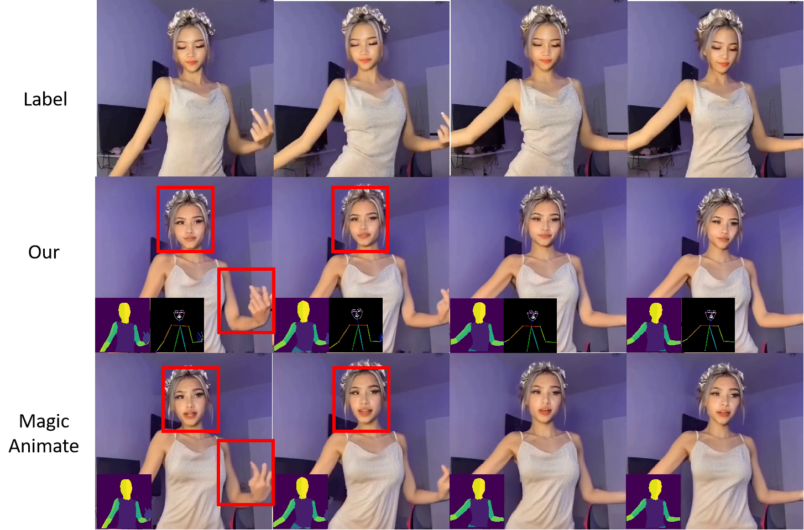

# Video-Animate (Human Dance generation)

Build upon Magic Animate and DWPose and DensePose. I modified Magic Animate by adding one more ControlNet to input the DWPose driven videos.

## Methods

I implemented one more Controlnet for DWpose, hoping the Stable Diffusion to learn the pose feature with facial and hand details.

## Results

