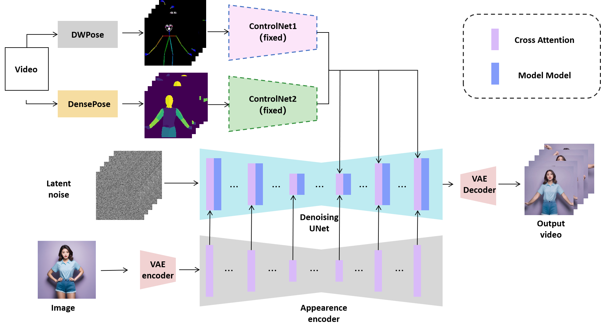

# Video-Animate (Human Dance generation)

Build upon Magic Animate and DWPose and DensePose. I modified Magic Animate by adding one more ControlNet to input the DWPose driven videos.

## Methods

## Results

